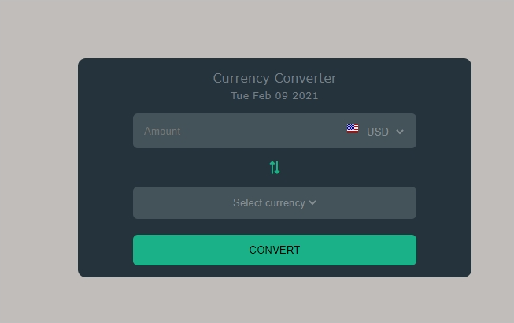

# Currency Converter  using  HTML CSS and Javascript.

- Currency Converter  webapp written in HTML, CSS and Javascript.

- Exchange rate is provided by [myCurrency.net](https://www.mycurrency.net/) free exchange rate API.

- country flags are provided by [countryflags](https://www.countryflags.io) free flags API.

- Exchange rate disclaimer is provided by [dollarclosing.com](http://www.dollarclosing.com/disclaimer.php)

- link to [deployed version on Vercel](https://curency-converter.bandeji.vercel.app/)

---

## Table of contents

- [Built with](#built-with)
- [Contributing](#Contributing)
- [License](#License)
- [Contact](#Contact)
- [Acknowledgement](#Acknowledgement)

---

## Built with

- HTML
- CSS
- Javascript

---

## Contributing

Pull requests are welcome. For major changes, please open an issue first to discuss what you would like to change.

---

## License

[MIT](https://choosealicense.com/licenses/mit/)

---

## Contact

You can reach out to me via:

- eckkoenterprise@gmail.com

## Acknowledgement

- [myCurrency.net](https://www.mycurrency.net/)
- [countryflags](https://www.countryflags.io)
- [dollarclosing.com](http://www.dollarclosing.com/disclaimer.php)
